# Eventify - Event Planning & Management Platform

**Developer:** **Ashini Sudusingha**  
**Final Year Project Evaluation Phase (Viva Status)**

> ⚠️ **IMPORTANT NOTE FOR VIVA EVALUATORS & REVIEWERS**  
> Currently, only the **Spring Boot Backend Microservice** (`eventify-springboot email sending`) has been uploaded to this repository for initial code review and demonstration. The remaining two native mobile components, namely the **Client Android Application (`Eventify`)** and the **Partner/Vendor Android Application (`EventifyPartner`)**, will be pushed to this repository immediately after the Viva examination is concluded.

---

Eventify is an enterprise-grade, modern, and robust multi-application ecosystem designed to streamline event planning and vendor collaboration. Created as a **Final Year Project**, it features a client-facing Android application, a dedicated partner/vendor Android application, and a Spring Boot microservice backend for high-reliability transactions and communications.

---

## 📱 App Walkthrough & User Interface

Here is a comprehensive visual showcase of the **Eventify** application ecosystem, illustrating the user onboarding flows, real-time networking checks, interactive planning modules, transaction handling, and location services.

### 🔐 1. Authentication, Onboarding & Error Handling

| 01. Splash Screen | 02. Sign In Screen | 03. Validation Error Handling |
| :---: | :---: | :---: |
|  <br/> *Graceful Entry & Logo* | 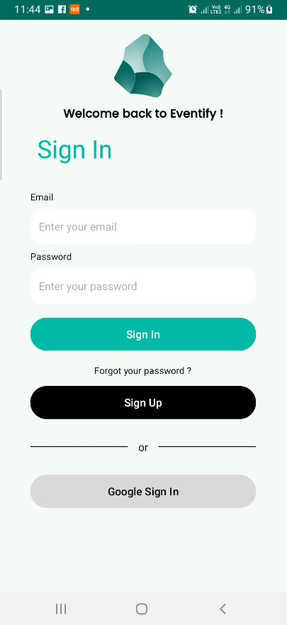 <br/> *Authentication Hub* | 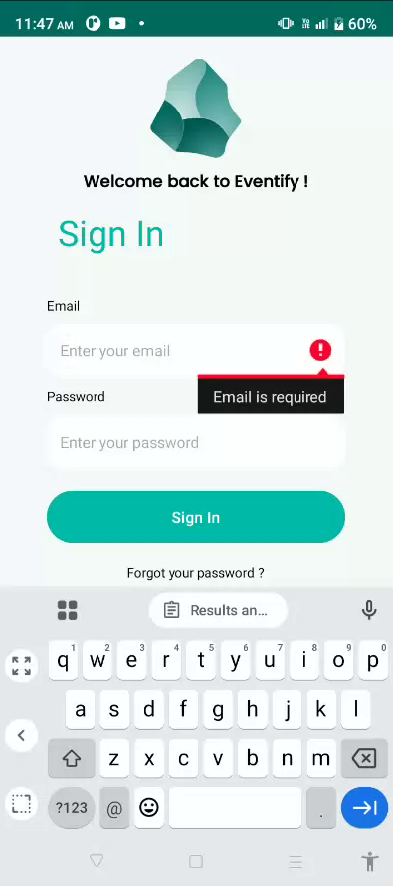 <br/> *Client-Side Validation* |

| 04. Offline Tolerance Dialog | 05. Sign Up Screen |
| :---: | :---: |
| 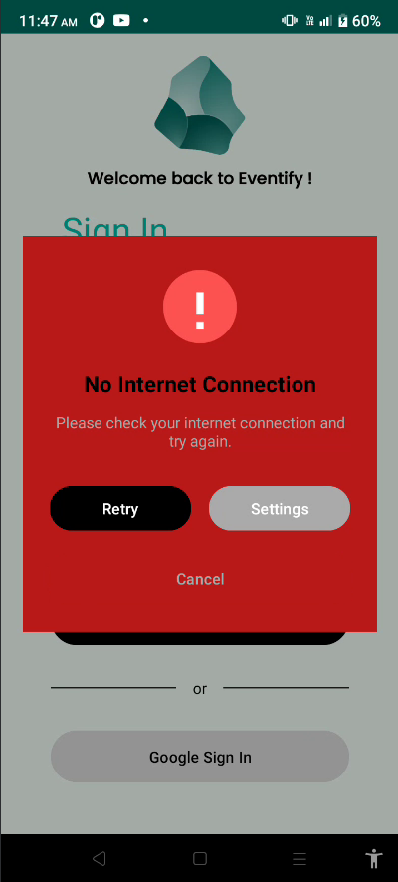 <br/> *Real-Time Network Monitor* | 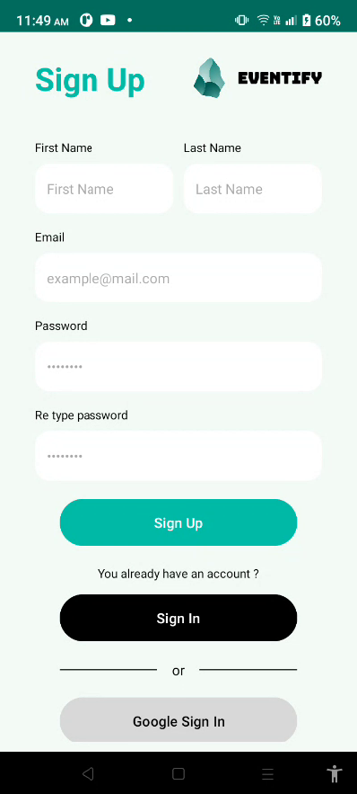 <br/> *Onboarding & Password Match* |

### 📧 2. Email Verification & Event Management Workflows

| 06. Email Verification Template | 07. Create Event Form | 08. Event Dashboard |
| :---: | :---: | :---: |
| 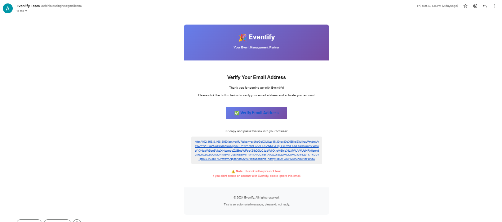 <br/> *SMTP Transaction Email* | 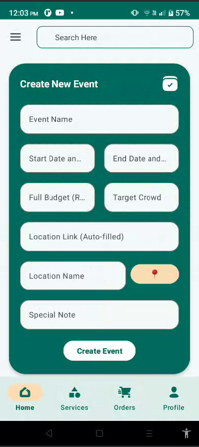 <br/> *Interactive Form Fields* | 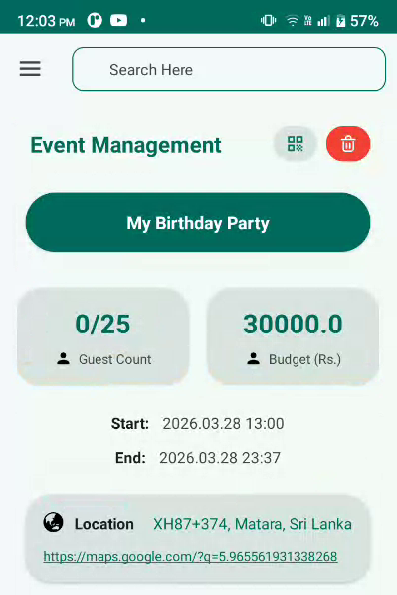 <br/> *Budget & Guest Counters* |

| 09. PayHere Sandbox Success | 10. Google Maps Location Picker |
| :---: | :---: |
| 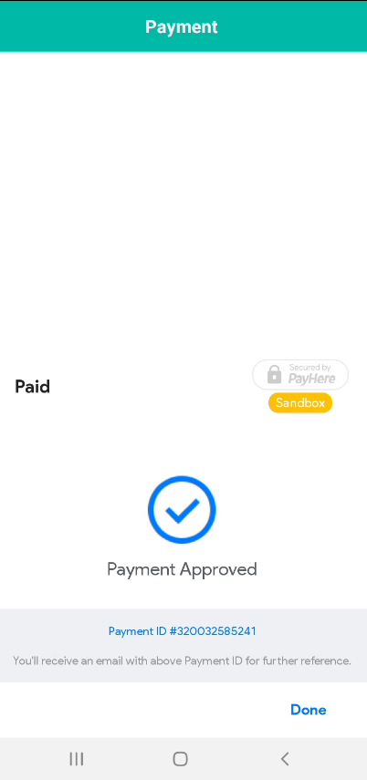 <br/> *PayHere Sandbox Integration* | 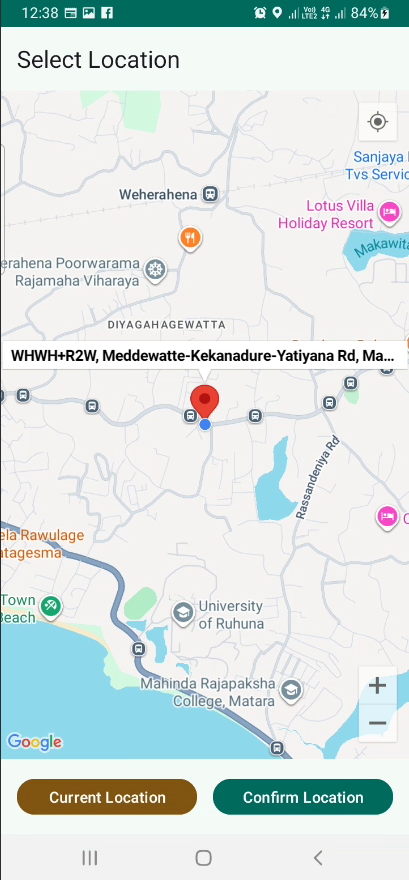 <br/> *Integrated Google Map Picker* |

### 📊 3. Advanced Guest Invitation & Budget Analysis

| 11. Guest Invitation & QR Ticket | 12. Budget Map & Expense Tracker |
| :---: | :---: |
| 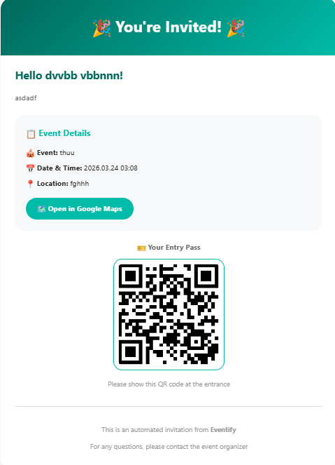 <br/> *QR Ticket Guest Invitation* | 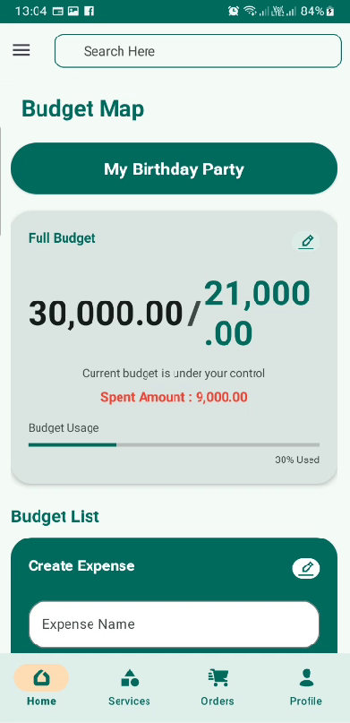 <br/> *Interactive Visual Budget Tool* |

| 13. Partner Portal Welcome | 14. In-App Verification Prompt |
| :---: | :---: |
| 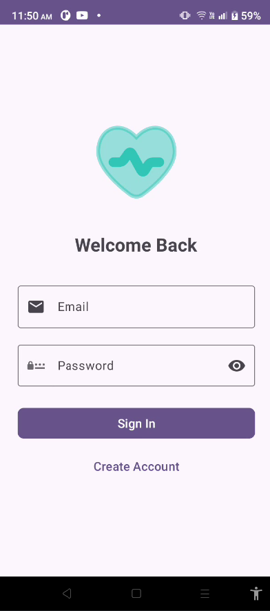 <br/> *Custom Partner Portal Hub* | 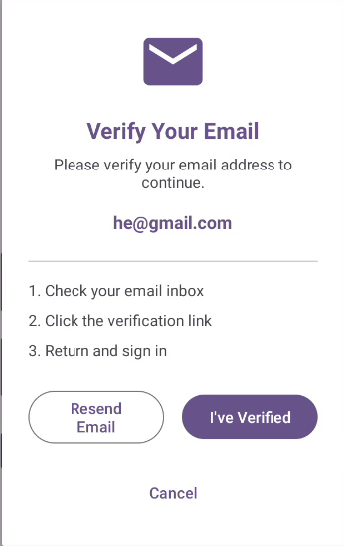 <br/> *Verification Step Guide* |

---

## 🏗️ System Architecture & Project Modules

The Eventify ecosystem is split into three main components:

### 1. 📱 `Eventify` (Client Application)
A native Android application built in **Java** that allows clients to book venues, coordinate services, browse vendor catalogues, and pay securely.
* **Onboarding & Authentication**: Secure sign-in including **Google Sign-In** and fallback **Email OTP verification**.
* **Location Intelligence**: Integrated **Google Maps SDK** and **Google Places API** to pick and pinpoint event venues.
* **Secure Payments**: Integrated **PayHere Android SDK** (Sri Lanka's leading payment gateway) for secure card transactions.
* **Ticket Issuance & Scanning**: Implements **ZXing QR Code generator** to create tickets, and an integrated **QR Camera Scanner** for venue ticket verification.
* **Real-Time Push Notifications**: Leveraging **Firebase Cloud Messaging (FCM)** for instant reservation updates.
* **Offline Resilience**: Automatic network listener that suspends network activity and alerts the user with an elegant interface overlay when connectivity is dropped.

### 2. 🤝 `EventifyPartner` (Vendor / Partner Application)
A native Android application built in **Java** dedicated to vendors, decorators, caterers, entertainers, and venue owners.
* **Business Profiles**: Register and establish specialized partner accounts.
* **High-Speed Media Uploads**: Integrated with **Cloudinary Android SDK** to upload high-definition venue and service images directly to Cloudinary's global Content Delivery Network (CDN).
* **Location Pinning**: Google Maps location picker allowing partners to pin their precise vendor locations.
* **Modern MVVM/State Management**: Built using Android **ViewModel** and **LiveData** architecture to survive screen rotations and conserve state.

### 3. ⚙️ `eventify-springboot email sending` (Microservice Backend)
A Spring Boot microservice written in **Java 17** acting as the security and communication engine.
* **Gmail SMTP Service**: Sends transaction receipts, registration greetings, and high-security OTPs.
* **JSON Web Tokens (JWT)**: Generates and validates cryptographic, time-expiring JWT tokens to secure email verification actions.
* **Firebase Admin SDK**: Safe server-to-server connection with the Firebase database (`eventify-bf480`) to synchronize users.

---

## 🛠️ Complete Technology Stack

### Client App (`Eventify`)
* **Core Language**: Java (JDK 11)
* **Build System**: Gradle
* **UI & Presentation**: Material Design Components, ConstraintLayout, Android ViewBinding, DotsIndicator
* **Networking**: Retrofit 3.0.0, Gson Converter, OkHttp 4.x
* **Identity & Database**: Firebase Auth, Firebase Firestore, Google Play Services Auth
* **Mapping**: Google Maps SDK, Play Services Location, Google Places
* **Transactions**: PayHere Android SDK (v3.0.18)
* **Utilities**: Glide 4.16 (Image caching), ZXing Android Embedded (QR Engine), Lombok (Boilerplate reduction)

### Partner App (`EventifyPartner`)
* **Core Language**: Java (JDK 8 compatibility)
* **Media & Cloud Storage**: Cloudinary Android SDK (v2.3.1)
* **Utilities**: Dhaval2404 Android ImagePicker, CircleImageView, Glide, Lombok
* **State Management**: Android LiveData & ViewModel-ktx (v2.7.0)
* **Networking**: Retrofit 2.9.0, OkHttp 4.12.0
* **Mapping**: Google Maps, Play Services Location, Google Places
* **Identity**: Firebase Auth, Firebase Firestore

### Backend Microservice (`eventify-springboot email sending`)
* **Core Framework**: Spring Boot 3.2.3 (Java 17, Maven build tool)
* **SMTP Gateway**: Spring Boot Starter Mail
* **Security & Tokens**: JJWT (Java JWT Library v0.11.5)
* **Cloud Admin**: Google Firebase Admin SDK (v9.2.0)
* **Boilerplate Control**: Project Lombok

---

## 📂 Project Directory Structure

```
Ashini 200450311681 Project/
│
├── Eventify/                                # CLIENT ANDROID APPLICATION
│   ├── app/
│   │   ├── src/main/
│   │   │   ├── java/com/ashinisudusingha/eventify/
│   │   │   │   ├── activity/                # UI Screens (Splash, SignIn, SignUp, MainActivity, QRScanner...)
│   │   │   │   ├── adapter/                 # Custom RecyclerView Adapters for Lists
│   │   │   │   ├── api/                     # Retrofit HTTP Interface definitions
│   │   │   │   ├── dto/                     # API Request/Response Data Transfer Objects
│   │   │   │   ├── fragment/                # Primary Nav Fragments (Home, Calendar, Bookings...)
│   │   │   │   ├── listener/                # Custom UI and network listeners
│   │   │   │   ├── manager/                 # Shared preference and network managers
│   │   │   │   ├── model/                   # Event, Booking and User data entities
│   │   │   │   ├── service/                 # Messaging & Notification services
│   │   │   │   └── utils/                   # Security, SMTP helper and generic utility functions
│   │   │   ├── res/                         # XML Layouts, Vector Drawables, Values & Styles
│   │   │   └── AndroidManifest.xml          # Core permissions & components configuration
│   │   ├── build.gradle                     # Gradle build configurations & dependencies
│   │   └── google-services.json             # Firebase configuration file
│   └── settings.gradle                      # Module inclusion definitions
│
├── EventifyPartner/                         # PARTNER / VENDOR ANDROID APPLICATION
│   ├── app/
│   │   ├── src/main/
│   │   │   ├── java/com/ashinisudusingha/eventifypartner/
│   │   │   │   ├── activity/                # Partner-specific screens (SignIn, SignUp, AuthViewModel...)
│   │   │   │   ├── adapter/                 # Custom adapters for listing vendor services
│   │   │   │   ├── api/                     # Retrofit networking services
│   │   │   │   ├── fragment/                # Vendor-specific profile & dashboard fragments
│   │   │   │   ├── repository/              # Repository patterns for database separation
│   │   │   │   └── services/                # Background actions & maps handling
│   │   │   ├── res/                         # Partner Layouts and Drawables
│   │   │   └── AndroidManifest.xml
│   │   └── build.gradle
│   └── settings.gradle
│
├── eventify-springboot email sending/        # SPRING BOOT BACKEND MICROSERVICE
│   ├── src/main/
│   │   ├── java/com/ashinisudusingha/eventify/
│   │   │   ├── EventifyApplication.java     # Boot Main application entry point
│   │   │   ├── configs/                     # AppConfig & Firebase Config files
│   │   │   ├── controllers/                 # REST endpoints (Verification, OTP, EmailInvitation)
│   │   │   ├── dto/                         # JSON API Data Transfer Objects
│   │   │   ├── model/                       # Data objects (OTPToken, Request models)
│   │   │   ├── services/                    # EmailService, OtpService, VerificationService, JwtService
│   │   │   └── utils/                       # Token helpers and security validators
│   │   └── resources/
│   │       ├── application.properties       # Core configurations (SMTP creds, Firebase Project, Port)
│   │       └── firebase-service-account.json # Secret Firebase credential file
│   └── pom.xml                              # Maven configuration & dependency listing
│
├── screenshots/                             # Project Screenshot Assets
│   ├── 01_splash_screen.png
│   ├── 02_sign_in.png
│   ├── 03_sign_in_validation.png
│   ├── 04_no_internet_connection.png
│   ├── 05_sign_up.png
│   ├── 06_email_verification_template.png
│   ├── 07_create_event_form.png
│   ├── 08_event_management_dashboard.png
│   ├── 09_payment_approved_payhere.png
│   ├── 10_google_maps_picker.png
│   ├── 11_email_invitation_ticket.png
│   ├── 12_budget_map_tracker.png
│   ├── 13_partner_sign_in.png
│   └── 14_app_email_verification_prompt.png
│
├── .gitignore                               # Global Git configuration (Android, Spring Boot, IDE files)
└── README.md                                # Official Project Documentation (This file)
```

---

## ⚙️ Installation & Running Guide

Follow these steps to set up and run the entire Eventify system locally.

### Prerequisites
* **Android Studio** (Koala / Ladybug or newer recommended)
* **Java Development Kit (JDK)**:
  * JDK 11+ configured for Android compilation.
  * JDK 17 configured for the Spring Boot backend.
* **Maven** (optional, wrappers are pre-packaged)
* **Firebase Console Account** (to download service account credentials).

---

### Step 1: Configure & Start the Spring Boot Backend

1. Navigate to the backend directory:
   ```bash
   cd "eventify-springboot email sending"
   ```
2. Open `src/main/resources/application.properties` and verify your parameters:
   * **Port**: The service runs on port `8080`.
   * **Gmail SMTP Setup**:
     ```properties
     spring.mail.username=your-gmail@gmail.com
     spring.mail.password=your-gmail-app-password
     ```
     > 💡 *Note: The password must be a 16-character Google App Password, not your standard Gmail login password.*
   * **Backend Local IP Binding**:
     ```properties
     app.frontend.url=http://192.168.8.168:8080
     app.base-url=http://192.168.8.168:8080
     ```
     Update `192.168.8.168` to match your workstation's local network IP address (e.g., `192.168.1.X`), so the Android apps running on virtual/physical devices can reach the backend.
3. Make sure the Firebase Admin Credentials file `firebase-service-account.json` exists in `src/main/resources/`.
4. Compile and launch the microservice:
   ```bash
   # Using Maven Wrapper
   ./mvnw spring-boot:run
   ```
   Alternatively, open the folder inside **IntelliJ IDEA** or **Eclipse** and run the `EventifyApplication.java` file.

---

### Step 2: Open and Run the Android Applications

Both `Eventify` and `EventifyPartner` are native Android projects. Set them up as follows:

1. Launch **Android Studio**.
2. Go to **File -> Open** and select the `Eventify` folder (Client application). Let Android Studio index the files and sync Gradle dependencies automatically.
3. Repeat the process to open `EventifyPartner` in a separate window.
4. **Configure Backend Endpoint IP**:
   * Open the networking file (usually under the `api` or `utils` package in Java, e.g. `api/RetrofitClient` or `utils/Constants`).
   * Update the `BASE_URL` to match your Spring Boot backend's local network IP:
     ```java
     public static final String BASE_URL = "http://192.168.8.168:8080/";
     ```
5. Ensure your target devices (emulators or physical phones) are connected to the **same local Wi-Fi network** as your backend server.
6. Press the green **Run (Play)** button in Android Studio to build and launch the client and partner apps on your devices.

---

## 🔒 Security & Best Practices

1. **Production Deployment**: For production release, never commit active passwords or key pairs (such as `firebase-service-account.json` or Gmail app passwords) to GitHub. Instead, store them in environment variables or a secure key store vault.
2. **Local Properties**: All sensitive SDK path links (like `sdk.dir` in `local.properties`) are ignored automatically by the global `.gitignore` file, maintaining local environmental security.
3. **Cryptographic Signatures**: The validation emails are encoded with secure HS256 HMAC JWT signatures, preventing email validation spoofing.
